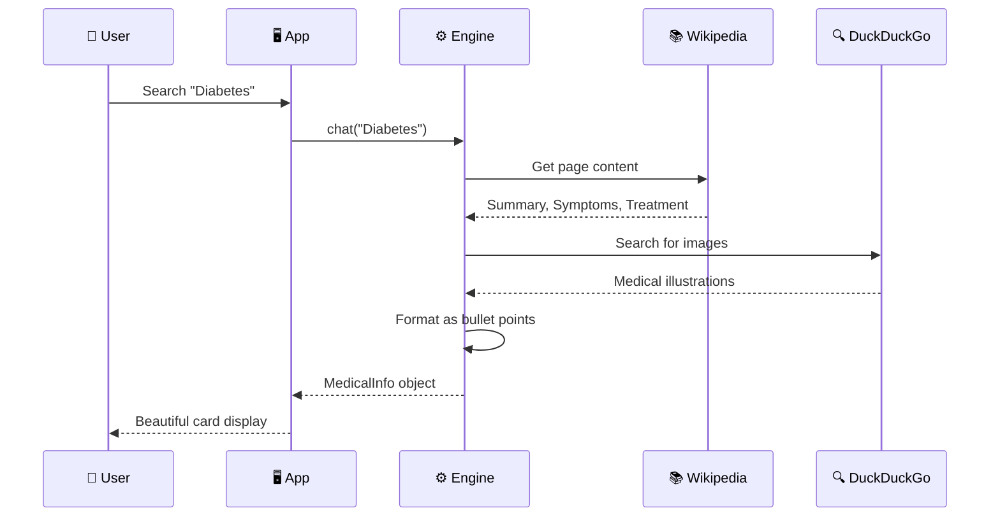

<p align="center">
  
</p>

<h1 align="center">🏥 Medical AI Encyclopedia</h1>

<p align="center">
  <strong>Your Intelligent Medical Information Assistant</strong>
</p>

<p align="center">
  
  
  
  
</p>

<p align="center">
  <a href="#-features">Features</a> •
  <a href="#-demo">Demo</a> •
  <a href="#-installation">Installation</a> •
  <a href="#-architecture">Architecture</a> •
  <a href="#-usage">Usage</a>
</p>

---

## ✨ Features

<table>
<tr>
<td width="50%">

### 🔍 Smart Search Engine
- Real-time data from **Wikipedia**
- Supplementary **Web Search** results
- Intelligent **Image Finder**
- **PDF Report** generation

</td>
<td width="50%">

### 🩺 Symptom Checker
- **AI-Powered** condition matching
- Local symptom database
- **Web Intelligence** analysis
- Multiple condition suggestions

</td>
</tr>
<tr>
<td width="50%">

### 🎤 Voice Search
- **Browser Native** speech recognition
- No API keys required
- Works on Chrome/Edge
- Clipboard auto-copy

</td>
<td width="50%">

### 🎨 Premium UI
- **Glass-morphism** design
- Animated gradients
- Dark theme optimized
- Fully responsive

</td>
</tr>
</table>

---

## 🎯 Demo

### Main Interface
```
🏥 Medical AI Encyclopedia
├── 🔍 Search Engine     - Search any disease/condition
├── 🩺 Symptom Checker   - Enter symptoms, get conditions
├── 🎤 Voice Search      - Speak to search
├── 📥 PDF Download      - Save reports offline
└── 🔗 Related Diseases  - Explore connected conditions
```

---

## 📊 System Architecture

```mermaid
flowchart LR
    subgraph User["👤 User"]
        Search[Search Query]
        Voice[Voice Input]
        Symptoms[Symptoms]
    end
    
    subgraph App["🖥️ Streamlit App"]
        UI[Premium UI]
        Tabs[Tabs System]
    end
    
    subgraph Engine["⚙️ AI Engine"]
        Chatbot[MedicalChatbot]
        PDF[PDF Generator]
        Checker[Symptom Checker]
    end
    
    subgraph Data["🌐 Data Sources"]
        Wiki[Wikipedia API]
        DDG[DuckDuckGo]
        Img[Image Search]
    end
    
    User --> App --> Engine --> Data
    Data --> Engine --> App --> User
```



---

## 🔄 How It Works



---

## 🚀 Installation

### Prerequisites
- Python 3.9 or higher
- pip package manager

### Quick Start

```bash
# Clone the repository
git clone https://github.com/yourusername/medical-ai-chatbot.git
cd medical-ai-chatbot

# Install dependencies
pip install -r requirements.txt

# Run the application
streamlit run app.py
```

### Dependencies

```
streamlit>=1.28.0
langchain
wikipedia
duckduckgo-search
fpdf2
Pillow
```

---

## 📁 Project Structure

```
medical-ai-chatbot/
│
├── 📄 app.py              # Main Streamlit application
├── 🤖 chatbot.py          # AI engine & data processing
├── ⚙️ config.py           # Configuration & constants
├── 📦 ingest.py           # Document ingestion (RAG)
├── 📋 requirements.txt    # Python dependencies
├── 📖 README.md           # This file
│
└── 📁 assets/
    └── 🖼️ banner.png      # Project banner
```

---

## 💻 Usage

### 1️⃣ Search for Diseases

Type any disease name in the search bar or use **Quick Access** buttons in the sidebar.

### 2️⃣ Check Symptoms

1. Go to **🩺 Global Symptom Checker** tab
2. Enter symptoms separated by commas
3. Get AI-powered condition suggestions

### 3️⃣ Voice Search

1. Click **🎤 Click to Speak**
2. Say a disease name
3. Paste with Ctrl+V and click Search

### 4️⃣ Download Reports

Click **📥 PDF** button on any disease card to download a formatted report.

---

## 🛠️ Tech Stack

| Technology | Purpose |
|------------|---------|
|  | Backend Logic |
|  | Web Framework |
|  | Data Source |
|  | Search & Images |

---

## 🎨 Screenshots

### Main Dashboard
- Animated glowing title
- Feature badges with gradients
- Dark glass-morphism theme

### Disease Cards
- Medical illustrations
- Bullet-point formatting
- Related conditions
- PDF download

### Symptom Checker
- Progress bars for match %
- Multiple conditions
- Click to learn more

---

## 🤝 Contributing

Contributions are welcome! Please feel free to submit a Pull Request.

1. Fork the project
2. Create your feature branch (`git checkout -b feature/AmazingFeature`)
3. Commit your changes (`git commit -m 'Add some AmazingFeature'`)
4. Push to the branch (`git push origin feature/AmazingFeature`)
5. Open a Pull Request

---

## 📄 License

This project is licensed under the MIT License - see the [LICENSE](LICENSE) file for details.

---

## ⚠️ Disclaimer

This application provides general health information only. It is **NOT** a substitute for professional medical advice, diagnosis, or treatment. Always consult a qualified healthcare provider for medical concerns.

---

<p align="center">
  Made with ❤️ by <a href="https://github.com/yourusername">Your Name</a>
</p>

<p align="center">
  ⭐ Star this repo if you find it helpful!
</p>


