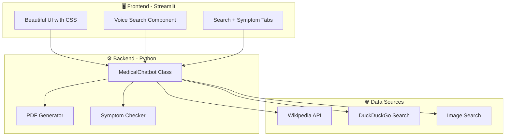
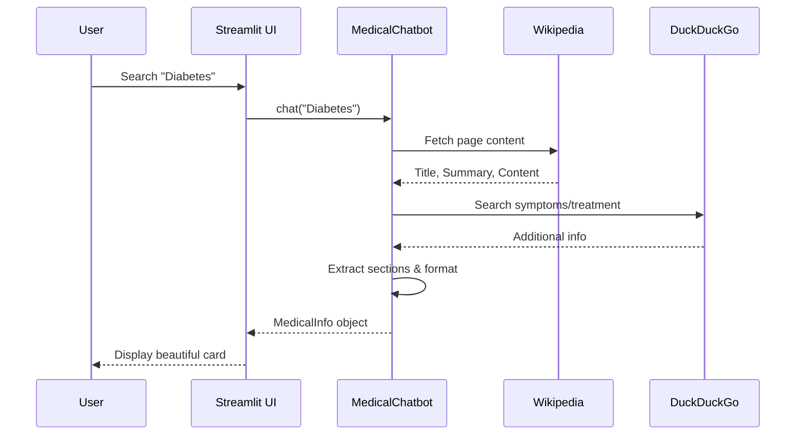
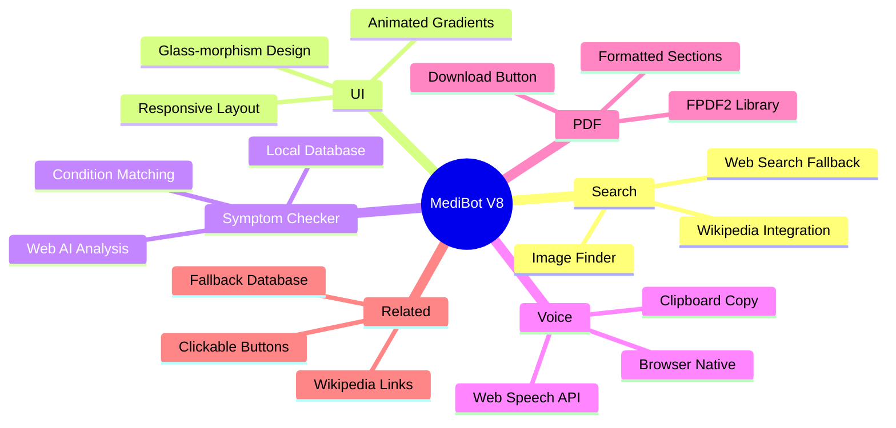

# 🏥 Medical AI Chatbot - Project Walkthrough

## Project Overview

This is a **Medical AI Encyclopedia** built with Python and Streamlit that provides comprehensive medical information through multiple intelligent features.

---

## 🎯 What We Built

A sophisticated medical chatbot that:
- Fetches real-time medical data from **Wikipedia** and **Web Search**
- Provides **Symptom Analysis** with AI-powered condition matching
- Supports **Voice Search** using browser's Web Speech API
- Generates **PDF Reports** for offline reference
- Features a **Premium UI** with glass-morphism design

---

## 📊 System Architecture



---

## 📁 Project Structure

```
medical-ai-chatbot/
├── app.py              # Main Streamlit application (UI + routing)
├── chatbot.py          # Core AI engine (data fetching + processing)
├── config.py           # Configuration and constants
├── requirements.txt    # Python dependencies
├── README.md           # Documentation
└── ingest.py           # Document ingestion (optional RAG)
```

---

## 🔄 Data Flow



---

## 🧩 Key Components

### 1️⃣ Frontend (`app.py`)

| Component | Purpose |
|-----------|---------|
| **CSS Styling** | Glass-morphism, gradients, animations |
| **Sidebar** | Voice search, history, quick access diseases |
| **Tabs** | Search Engine + Symptom Checker |
| **Medical Card** | Displays disease info with sections |

### 2️⃣ Backend (`chatbot.py`)

| Class/Function | Purpose |
|----------------|---------|
| `MedicalChatbot` | Main AI engine |
| `chat()` | Fetches and processes disease data |
| `check_symptoms()` | Analyzes symptoms → conditions |
| `generate_pdf()` | Creates downloadable PDF reports |
| `_get_wikipedia_info()` | Wikipedia data extraction |
| `_search_medical_image()` | Finds relevant medical images |

---

## ✨ Features Implemented



---

## 🛠️ Technologies Used

| Technology | Purpose |
|------------|---------|
| **Streamlit** | Web framework |
| **Python 3** | Backend logic |
| **Wikipedia API** | Medical data source |
| **DuckDuckGo** | Web search + images |
| **FPDF2** | PDF generation |
| **Web Speech API** | Browser voice recognition |
| **CSS/HTML** | Premium styling |

---

## 🚀 How to Run

```bash
# 1. Install dependencies
pip install -r requirements.txt

# 2. Run the app
streamlit run app.py

# 3. Open browser
# http://localhost:8501
```

---

## 📋 Requirements

```
streamlit
langchain
wikipedia
duckduckgo-search
fpdf2
Pillow
```

---

## 🎨 UI Screenshots

The application features:
- **Glowing animated title** with gradient colors
- **Feature badges** with distinct colors (Green, Purple, Pink, Orange)
- **Dark theme** with glass-morphism cards
- **Hover effects** on all buttons
- **Emergency alerts** for critical conditions

---

## 🔮 Future Enhancements

- [ ] Multi-language support
- [ ] Drug interaction checker
- [ ] User authentication
- [ ] Save favorites
- [ ] Mobile app version

---

## 📝 Summary

We built a **complete Medical AI Encyclopedia** that:

1. ✅ Fetches real medical data from Wikipedia & Web
2. ✅ Displays information in beautiful card layouts
3. ✅ Analyzes symptoms and suggests conditions
4. ✅ Supports voice input for hands-free search
5. ✅ Generates downloadable PDF reports
6. ✅ Shows related conditions for exploration
7. ✅ Has a premium, responsive UI design

**Total Development Time**: ~6 hours  
**Lines of Code**: ~800+ lines  
**Key Files**: 6 Python files
